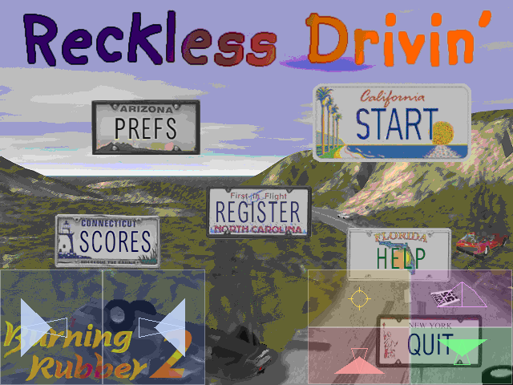
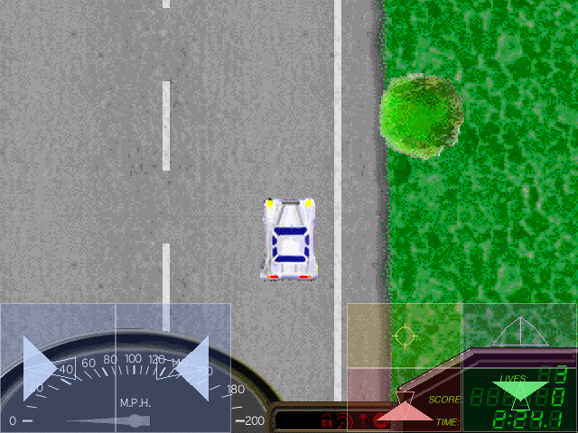

# Reckless Drivin' — WebAssembly Port

> A fan-made SDL2 / Emscripten port of the classic Mac OS 9 racing game **Reckless Drivin'** by Jonas Echterhoff.

**Play online:** [https://lachlanbwwright.github.io/RecklessDrivinPort/](https://lachlanbwwright.github.io/RecklessDrivinPort/)

| Menu | Gameplay |
|---|---|
|  |  |

## Running locally (5 minutes)

### Option A — Level editor only (no Emscripten needed)

```bash
git clone https://github.com/LachlanBWWright/RecklessDrivinPort.git
cd RecklessDrivinPort/angular-site
npm ci
npm start
```

Open **http://localhost:4200/** in your browser.

The level editor works immediately. The game panel will show a "WASM bundle missing"
message until you also complete Option B below.

> **Note:** Always use `npm start`, not `npx ng serve`. The `prestart` lifecycle hook
> copies `port/resources/resources.dat` into the dev assets automatically. Skipping it
> means "Load Default" will return a 404 error.

### Option B — Full game + editor (requires Emscripten)

**Prerequisites:**

| Tool | Version |
|---|---|
| Node.js | 20 or later |
| npm | bundled with Node.js |
| cmake | 3.13 or later |
| Emscripten SDK | any recent release (tested with 3.1.55) |

**Install Emscripten** (if not already installed):

```bash
git clone https://github.com/emscripten-core/emsdk.git
cd emsdk
./emsdk install latest
./emsdk activate latest
source ./emsdk_env.sh   # or emsdk_env.bat on Windows
cd ..
```

**Build and run:**

```bash
# 1. Build the WASM bundle
emcmake cmake -B build_wasm -DCMAKE_BUILD_TYPE=Release -DPORT_SDL2=ON
cmake --build build_wasm --parallel

# 2. Start the Angular dev server (prestart syncs WASM files automatically)
cd angular-site
npm ci
npm start
```

Open **http://localhost:4200/** and click **Start** to play.

### Option C — Full production-like build (one command)

```bash
./scripts/build-wasm-local.sh --serve
```

This builds both WASM and Angular, assembles `gh-pages-local/`, and serves it
at **http://localhost:8080/** with the correct `application/wasm` MIME type.

Useful flags: `--skip-wasm`, `--skip-angular`, `--port 3000`, `--no-cleanup`.

## Repository layout

| Path | Purpose |
|---|---|
| `angular-site/` | Angular frontend — hosts the game and level editor |
| `source/`, `headers/` | Native / WASM game source code |
| `port/platform/` | Platform backends (SDL2, Emscripten) |
| `port/resources/resources.dat` | Default game resources (tracked in git) |
| `build_wasm/` | Emscripten output — generated, gitignored |
| `scripts/` | Build and deployment helper scripts |
| `documentation/` | Format notes and reverse-engineering docs |
| `screenshots/` | In-game screenshots |

## Quick links

- Full developer notes: [`dev-readme.md`](dev-readme.md)
- Level editor data format: [`documentation/level-editor-data-structures.md`](documentation/level-editor-data-structures.md)

## Troubleshooting

**"WASM bundle missing" in the game panel** — you haven't built the WASM bundle yet (Option B).
The level editor still works without it.

**"Failed to load resources" / 404 on resources.dat** — you ran `npx ng serve` directly
instead of `npm start`. Always use `npm start` so the `prestart` hook copies the assets.

**Spinner in level editor never goes away** — open DevTools → Console and look for worker
errors. The most common cause is opening the page from a `file://` URL; always use the dev
server (`npm start`).

**cmake / emcmake not found** — activate the Emscripten SDK first:
`source /path/to/emsdk/emsdk_env.sh`

## Acknowledgements

Original game by **Jonas Echterhoff** — source code at https://github.com/jechter/RecklessDrivin.
This fan-made port builds on earlier work by Nathan Craddock
(https://github.com/natecraddock/open-reckless-drivin) and uses Pomme by Jorio
(https://github.com/jorio/Pomme). Research and documentation by Nathan Craddock.
